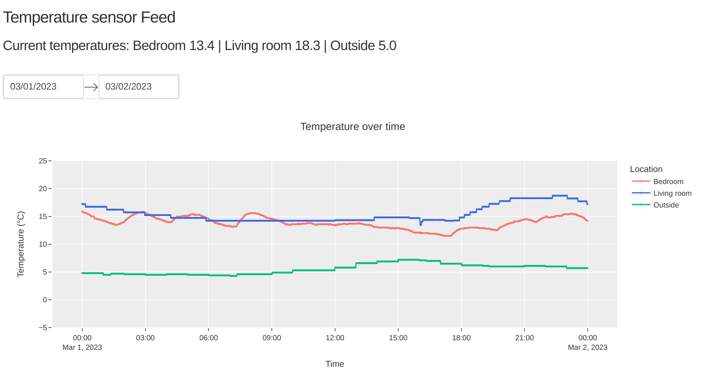

# Raspberry Pi Temperature Sensor plotting

Plotting and hosting webserver on raspberry pi with temperature and humidity sensor

This project serves as a practical intro to plotting live temperature data using the DHT22 sensor for the raspberry pi and learning the plotly dash library for accessing data stored in a sqlite database. External data sources are also used in the plot to compare temperature in different rooms and the external temperature.

Feature ideas:
- [X] Save sensor data from pi as csv
- [X] Write data to sqlite database
- [X] Plot csv data in Python
- [X] Host server on pi with API to get sensor updates
- [X] Separate backend data logging with frontend interval plotting
- [X] Plot sensor updates real-time with sever on pi - done using dash callback instead of flask API
- [X] Get outside temperature as data for plot
- [X] Access nest thermostat API and add to plot
